# Entity Relationship Diagram (ERD)

## Hệ thống quản lý vận chuyển và công nợ Unicon Schedule

### Sơ đồ ERD

```mermaid
erDiagram
    User ||--o| Driver : "is"
    User ||--o{ Dispatch : "assigns"
    User ||--o{ ShipmentStatusEvent : "creates"
    User ||--o{ POD : "uploads"
    User ||--o{ Debt : "creates"
    User }o--o| Customer : "belongs to"
    
    Customer ||--o{ User : "has users"
    Customer ||--o{ Order : "places"
    Customer ||--o{ Debt : "has"
    
    Order ||--o{ Shipment : "contains"
    
    Shipment ||--o{ ShipmentStop : "has"
    Shipment ||--o| Dispatch : "assigned to"
    Shipment ||--o{ ShipmentStatusEvent : "tracks"
    Shipment ||--o{ POD : "has proof"
    
    ShipmentStop ||--o{ POD : "has proof at"
    
    Vehicle ||--o{ Dispatch : "used in"
    
    Driver ||--o{ Dispatch : "drives"
    
    User {
        string id PK "[✓] Mã định danh duy nhất"
        string email UK "[✓] Email đăng nhập duy nhất"
        string password "[○] Mật khẩu được mã hóa bởi Wasp"
        string fullName "[✓] Họ và tên đầy đủ"
        UserType userType "[✓] Loại user - INTERNAL hoặc CUSTOMER"
        UserRole role "[✓] Vai trò - mặc định OPS"
        string customerId FK "[○] Tham chiếu đến Customer nếu là user khách hàng"
        boolean isActive "[✓] Trạng thái hoạt động - mặc định true"
        datetime lastLogin "[○] Thời gian đăng nhập gần nhất"
        datetime createdAt "[✓] Thời gian tạo - tự động"
        datetime updatedAt "[✓] Thời gian cập nhật - tự động"
    }
    
    Customer {
        string id PK "[✓] Mã định danh duy nhất"
        string name "[✓] Tên khách hàng"
        string email UK "[✓] Email duy nhất"
        string phone "[○] Số điện thoại liên hệ"
        string address "[○] Địa chỉ khách hàng"
        int paymentTermDays "[✓] Số ngày công nợ - mặc định 30"
        PaymentTermType paymentTermType "[✓] Loại kỳ hạn thanh toán - mặc định DAYS"
        StatementFrequency statementFrequency "[○] Quy định chốt bảng kê"
        boolean hasVATInvoice "[✓] Có xuất HĐ VAT - mặc định false"
        string invoiceName "[○] Tên trên hóa đơn"
        string taxCode "[○] Mã số thuế"
        string taxAddress "[○] Địa chỉ thuế"
        CustomerStatus status "[✓] Trạng thái hợp tác - mặc định ACTIVE"
        datetime createdAt "[✓] Thời gian tạo - tự động"
        datetime updatedAt "[✓] Thời gian cập nhật - tự động"
    }
    
    Order {
        string id PK "[✓] Mã định danh duy nhất"
        string customerId FK "[✓] Tham chiếu đến khách hàng"
        string orderNumber UK "[✓] Mã đơn hàng duy nhất"
        string description "[○] Mô tả đơn hàng"
        decimal totalWeight "[○] Tổng trọng lượng (kg)"
        decimal totalVolume "[○] Tổng thể tích (m3)"
        string specialInstructions "[○] Hướng dẫn đặc biệt"
        OrderStatus status "[✓] Trạng thái đơn hàng - mặc định DRAFT"
        datetime createdAt "[✓] Thời gian tạo - tự động"
        datetime updatedAt "[✓] Thời gian cập nhật - tự động"
        datetime deletedAt "[○] Thời gian xóa mềm"
    }
    
    Shipment {
        string id PK "[✓] Mã định danh duy nhất"
        string orderId FK "[✓] Tham chiếu đến đơn hàng"
        string shipmentNumber UK "[✓] Mã lô hàng duy nhất"
        ShipmentStatus currentStatus "[✓] Trạng thái hiện tại - mặc định DRAFT"
        Priority priority "[✓] Độ ưu tiên - mặc định NORMAL"
        datetime plannedStartDate "[✓] Ngày bắt đầu dự kiến"
        datetime plannedEndDate "[✓] Ngày kết thúc dự kiến"
        datetime actualStartDate "[○] Ngày bắt đầu thực tế"
        datetime actualEndDate "[○] Ngày kết thúc thực tế"
        datetime createdAt "[✓] Thời gian tạo - tự động"
        datetime updatedAt "[✓] Thời gian cập nhật - tự động"
        datetime deletedAt "[○] Thời gian xóa mềm"
    }
    
    ShipmentStop {
        string id PK "[✓] Mã định danh duy nhất"
        string shipmentId FK "[✓] Tham chiếu đến lô hàng"
        int sequence "[✓] Thứ tự điểm dừng"
        StopType stopType "[✓] Loại điểm dừng"
        string locationName "[✓] Tên địa điểm"
        string address "[✓] Địa chỉ đầy đủ"
        string contactPerson "[○] Tên người liên hệ"
        string contactPhone "[○] Số điện thoại liên hệ"
        datetime plannedArrival "[✓] Thời gian đến dự kiến"
        datetime plannedDeparture "[✓] Thời gian rời dự kiến"
        datetime actualArrival "[○] Thời gian đến thực tế"
        datetime actualDeparture "[○] Thời gian rời thực tế"
        string specialInstructions "[○] Hướng dẫn đặc biệt"
        datetime createdAt "[✓] Thời gian tạo - tự động"
    }
    
    Vehicle {
        string id PK "[✓] Mã định danh duy nhất"
        string licensePlate UK "[✓] Biển số xe duy nhất"
        VehicleType vehicleType "[✓] Loại phương tiện - Đầu kéo hoặc Mooc"
        int manufacturingYear "[○] Năm sản xuất"
        VehicleStatus status "[✓] Trạng thái xe - mặc định AVAILABLE"
        string[] registrationImages "[✓] Hình đăng ký - multi images"
        string[] inspectionImages "[✓] Hình đăng kiểm - multi images"
        string[] insuranceImages "[○] Hình bảo hiểm - multi images"
        datetime operationExpiryDate "[✓] Ngày hết hạn vận hành"
        datetime inspectionExpiryDate "[✓] Ngày hết hạn đăng kiểm"
        datetime insuranceExpiryDate "[✓] Ngày hết hạn bảo hiểm"
        VehicleCompany company "[✓] Trực thuộc công ty - Khánh Huy hoặc Unicon"
        string currentLocation "[○] Vị trí hiện tại"
        datetime createdAt "[✓] Thời gian tạo - tự động"
        datetime updatedAt "[✓] Thời gian cập nhật - tự động"
    }
    
    Driver {
        string id PK "[✓] Mã định danh duy nhất"
        string userId FK "[✓] Tham chiếu User duy nhất"
        string fullName "[✓] Họ và tên đầy đủ"
        string phone "[✓] Số điện thoại liên hệ"
        string[] citizenIdImages "[✓] Hình CCCD - multi images"
        int birthYear "[○] Năm sinh"
        string hometown "[○] Quê quán"
        string[] licenseImages "[✓] Hình bằng lái - multi images"
        datetime licenseExpiry "[✓] Ngày hết hạn giấy phép"
        DriverStatus status "[✓] Trạng thái tài xế - mặc định ACTIVE"
        datetime createdAt "[✓] Thời gian tạo - tự động"
        datetime updatedAt "[✓] Thời gian cập nhật - tự động"
    }
    
    Dispatch {
        string id PK "[✓] Mã định danh duy nhất"
        string shipmentId FK "[✓] Tham chiếu Shipment duy nhất"
        string vehicleId FK "[✓] Tham chiếu đến phương tiện"
        string driverId FK "[✓] Tham chiếu đến tài xế"
        string assignedById FK "[✓] Người thực hiện điều phối"
        datetime assignedAt "[✓] Thời gian điều phối - mặc định now"
        string notes "[○] Ghi chú điều phối"
        datetime createdAt "[✓] Thời gian tạo - tự động"
    }
    
    ShipmentStatusEvent {
        string id PK "[✓] Mã định danh duy nhất"
        string shipmentId FK "[✓] Tham chiếu đến lô hàng"
        ShipmentStatus status "[✓] Trạng thái mới"
        EventType eventType "[✓] Loại sự kiện"
        string description "[✓] Mô tả sự kiện"
        string location "[○] Vị trí xảy ra sự kiện"
        string createdById FK "[✓] Người tạo sự kiện"
        datetime createdAt "[✓] Thời gian tạo - tự động"
    }
    
    POD {
        string id PK "[✓] Mã định danh duy nhất"
        string shipmentId FK "[✓] Tham chiếu đến lô hàng"
        string stopId FK "[○] Tham chiếu đến điểm dừng"
        string fileName "[✓] Tên file"
        string filePath "[✓] Đường dẫn lưu trữ URL"
        PODFileType fileType "[✓] Loại file"
        int fileSize "[✓] Kích thước file (bytes) - tối đa 5MB"
        string uploadedById FK "[✓] Người tải lên"
        datetime uploadedAt "[✓] Thời gian tải lên - tự động"
        boolean isSubmitted "[✓] Đã submit - mặc định false - không sửa được"
    }
    
    Debt {
        string id PK "[✓] Mã định danh duy nhất"
        string customerId FK "[✓] Tham chiếu đến khách hàng"
        DebtType debtType "[✓] Loại công nợ"
        string debtMonth "[✓] Tháng công nợ - định dạng YYYY-MM"
        decimal amount "[✓] Số tiền công nợ"
        string documentLink "[○] Link Google Sheet bảng kê"
        string[] invoiceImages "[✓] Mảng URL hình ảnh hóa đơn"
        string notes "[○] Ghi chú bổ sung"
        datetime recognitionDate "[✓] Ngày ghi nhận công nợ - mặc định now"
        datetime dueDate "[✓] Ngày đến hạn - tự động tính"
        DebtStatus status "[✓] Trạng thái công nợ - mặc định UNPAID"
        decimal paidAmount "[○] Số tiền đã thanh toán"
        datetime paidDate "[○] Ngày thanh toán"
        string[] paymentProofImages "[✓] Mảng URL chứng từ UNC"
        string paymentNotes "[○] Ghi chú thanh toán"
        string createdById FK "[✓] Người tạo công nợ"
        datetime createdAt "[✓] Thời gian tạo - tự động"
        datetime updatedAt "[✓] Thời gian cập nhật - tự động"
        datetime deletedAt "[○] Thời gian xóa mềm"
    }
```

---

## Mô tả các Entity chính

### 1. **User** (Người dùng)
- Quản lý tất cả người dùng trong hệ thống (cả nội bộ và khách hàng)
- **Loại user (UserType)**:
  - INTERNAL: Nhân viên nội bộ (Admin, Kế toán, Vận hành, Điều phối, Tài xế)
  - CUSTOMER: User của khách hàng (Chủ hàng, Vận hành khách hàng)
- **Vai trò nội bộ**: ADMIN, ACCOUNTING, OPS, DISPATCHER, DRIVER
- **Vai trò khách hàng**: CUSTOMER_OWNER, CUSTOMER_OPS
- User khách hàng được link đến Customer qua customerId
- Có thể là Driver (quan hệ 1-1)

### 2. **Customer** (Khách hàng)
- Thông tin khách hàng và công ty
- **Điều khoản thanh toán**: Số ngày công nợ, loại kỳ hạn
- **Quy định chốt bảng kê**: 1 tháng 1 lần (ngày 25 hoặc 30/31), 1 tuần 1 lần, 1 tháng 2 lần (ngày 15 và 31)
- **Thông tin hóa đơn VAT**: Có xuất HĐ VAT, tên trên HĐ, MST, địa chỉ thuế
- **Trạng thái hợp tác**: Đang hợp tác / Ngưng hợp tác
- Có nhiều user (chủ hàng, vận hành)
- Có nhiều đơn hàng và công nợ

### 3. **Order** (Đơn hàng)
- Đơn hàng từ khách hàng
- Trạng thái: DRAFT, CONFIRMED, CANCELLED
- Chứa nhiều shipment

### 4. **Shipment** (Lô hàng)
- Lô hàng cần vận chuyển
- Trạng thái: DRAFT, READY, ASSIGNED, IN_TRANSIT, COMPLETED, CANCELLED
- Có nhiều điểm dừng (stops)
- Được gán cho 1 dispatch

### 5. **ShipmentStop** (Điểm dừng)
- Các điểm trong hành trình vận chuyển
- Loại: PICKUP, DROPOFF, DEPOT, PORT
- Có thời gian kế hoạch và thực tế

### 6. **Vehicle** (Phương tiện)
- **Loại xe**: Đầu kéo (TRACTOR) hoặc Mooc (TRAILER)
- **Thông tin cơ bản**: Biển số xe, năm sản xuất
- **Giấy tờ xe**: Hình đăng ký, đăng kiểm, bảo hiểm (multi images)
- **Ngày hết hạn**: Vận hành, đăng kiểm, bảo hiểm
- **Trực thuộc công ty**: Khánh Huy hoặc Unicon
- **Trạng thái**: AVAILABLE, IN_USE, MAINTENANCE, OUT_OF_SERVICE
- Được sử dụng trong nhiều dispatch

### 7. **Driver** (Tài xế)
- **Thông tin cá nhân**: Họ tên, số điện thoại, năm sinh, quê quán
- **Giấy tờ**: CCCD (multi images), Bằng lái (multi images)
- **Ngày hết hạn**: Giấy phép lái xe
- **Trạng thái**: ACTIVE, INACTIVE, SUSPENDED
- Liên kết với User (quan hệ 1-1)
- Thực hiện nhiều dispatch

### 8. **Dispatch** (Điều phối)
- Gán shipment cho xe và tài xế
- Quan hệ 1-1 với Shipment
- Được tạo bởi User (dispatcher)

### 9. **ShipmentStatusEvent** (Sự kiện trạng thái)
- Theo dõi lịch sử thay đổi trạng thái
- Loại: STATUS_CHANGE, EXCEPTION, NOTE
- Ghi nhận vị trí và mô tả

### 10. **POD** (Proof of Delivery)
- Chứng từ giao hàng
- Hình ảnh hoặc PDF
- Liên kết với shipment và stop
- Không thể sửa sau khi submit

### 11. **Debt** (Công nợ)
- Quản lý công nợ khách hàng
- Loại: FREIGHT (cước vận chuyển), ADVANCE (chi hộ), OTHER
- Trạng thái: UNPAID, PAID, OVERDUE, CANCELLED
- Theo dõi theo tháng (debtMonth)
- Có hóa đơn và chứng từ thanh toán

---

## Các Enum quan trọng

### OrderStatus
- DRAFT, CONFIRMED, CANCELLED

### ShipmentStatus
- DRAFT, READY, ASSIGNED, IN_TRANSIT, COMPLETED, CANCELLED

### Priority
- LOW, NORMAL, HIGH, URGENT

### StopType
- PICKUP, DROPOFF, DEPOT, PORT

### VehicleType
- TRACTOR (Đầu kéo)
- TRAILER (Mooc)

### VehicleStatus
- AVAILABLE (Sẵn sàng)
- IN_USE (Đang sử dụng)
- MAINTENANCE (Bảo trì)
- OUT_OF_SERVICE (Ngưng hoạt động)

### VehicleCompany
- KHANH_HUY (Khánh Huy)
- UNICON (Unicon)

### DriverStatus
- ACTIVE, INACTIVE, SUSPENDED

### UserType
- INTERNAL (Nội bộ)
- CUSTOMER (Khách hàng)

### UserRole
**Nội bộ:**
- ADMIN (Quản trị viên)
- ACCOUNTING (Kế toán)
- OPS (Vận hành nội bộ)
- DISPATCHER (Điều phối)
- DRIVER (Tài xế)

**Khách hàng:**
- CUSTOMER_OWNER (Chủ hàng)
- CUSTOMER_OPS (Vận hành khách hàng)

### DebtType
- FREIGHT (Công nợ cước vận chuyển)
- ADVANCE (Công nợ chi hộ)
- OTHER (Công nợ khác)

### DebtStatus
- UNPAID (Chưa thanh toán)
- PAID (Đã thanh toán)
- OVERDUE (Quá hạn)
- CANCELLED (Đã hủy)

### PaymentTermType
- DAYS (20 ngày, 30 ngày)
- MONTHS (1 tháng, 3 tháng)

### StatementFrequency (Quy định chốt bảng kê)
- MONTHLY_25 (1 tháng 1 lần vào ngày 25)
- MONTHLY_30 (1 tháng 1 lần vào ngày 30/31)
- WEEKLY (1 tuần 1 lần)
- BIMONTHLY (1 tháng 2 lần vào ngày 15 và 31)

### CustomerStatus
- ACTIVE (Đang hợp tác)
- INACTIVE (Ngưng hợp tác)

---

## Quan hệ chính

1. **Customer → User**: Khách hàng có nhiều user (chủ hàng, vận hành)
2. **Customer → Order → Shipment**: Luồng đơn hàng từ khách hàng
3. **Shipment → Dispatch → (Vehicle + Driver)**: Điều phối vận chuyển
4. **Shipment → ShipmentStop → POD**: Theo dõi hành trình và chứng từ
5. **Shipment → ShipmentStatusEvent**: Lịch sử trạng thái
6. **Customer → Debt**: Quản lý công nợ khách hàng
7. **User → Driver**: Tài xế là một loại người dùng đặc biệt (nội bộ)

## Phân quyền User

### Phía nội bộ (UserType = INTERNAL):
- **ADMIN**: Quản trị viên - toàn quyền hệ thống
- **ACCOUNTING**: Kế toán - quản lý công nợ, hóa đơn
- **OPS**: Vận hành nội bộ - quản lý đơn hàng, shipment
- **DISPATCHER**: Điều phối - gán xe, tài xế cho shipment
- **DRIVER**: Tài xế - xem shipment được gán, cập nhật trạng thái, upload POD

### Phía khách hàng (UserType = CUSTOMER):
- **CUSTOMER_OWNER**: Chủ hàng - xem tất cả đơn hàng, công nợ của công ty mình
- **CUSTOMER_OPS**: Vận hành khách hàng - tạo đơn hàng, theo dõi shipment của công ty mình

---

## Tính năng Soft Delete

Các entity sau hỗ trợ soft delete (deletedAt):
- Order
- Shipment
- Debt

---

## Indexes quan trọng

- `shipments`: (currentStatus, plannedStartDate)
- `shipment_stops`: (shipmentId, sequence)
- `shipment_status_events`: (shipmentId, createdAt)
- `pods`: (shipmentId, isSubmitted)
- `debts`: (customerId, debtMonth), (status, dueDate), (debtMonth)

---

**Ngày tạo**: 2026-02-05  
**Hệ thống**: Unicon Schedule - Quản lý vận chuyển và công nợ
