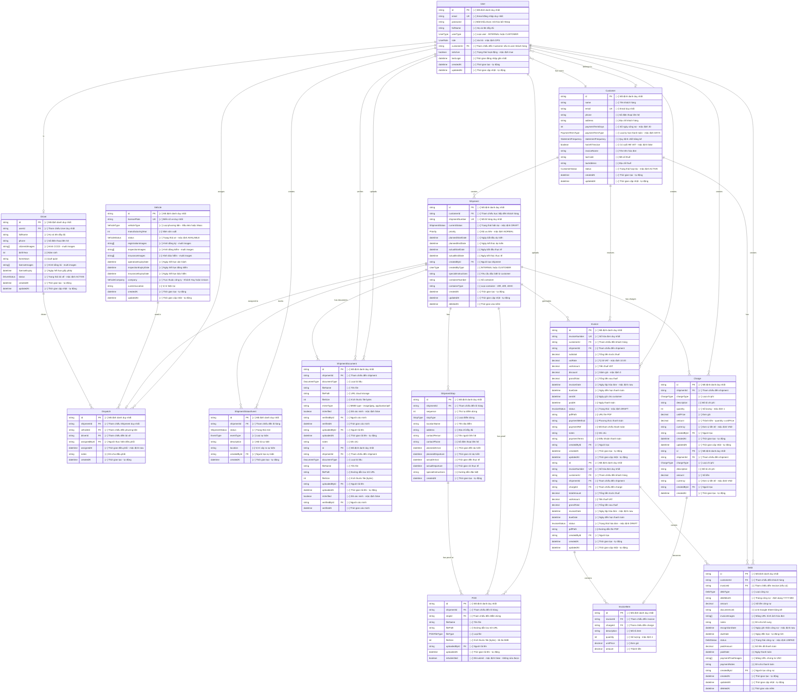

# Entity Relationship Diagram (ERD)

## Hệ thống quản lý vận chuyển và công nợ Unicon Schedule

**Phiên bản:** 2.1  
**Cập nhật:** 12/02/2026  
**Trạng thái:** Updated theo PRD & Implementation Plan v1.1

### 🔄 Thay đổi chính (v2.1)
- ❌ **XÓA Order entity** - Không cần thiết theo PRD, đơn giản hóa workflow
- ✅ **Shipment link trực tiếp Customer** - customerId thay vì orderId
- ✅ Thêm **ShipmentDocument** entity - Quản lý tài liệu shipment (booking, bill of lading, customs)
- ✅ Thêm **Charge** entity - Quản lý chi phí theo shipment
- ✅ Thêm **Invoice** entity - Quản lý hóa đơn và billing
- ✅ Cập nhật quan hệ: Invoice ↔ Debt, Charge ↔ Invoice, Shipment ↔ Documents
- ✅ Workflow đơn giản: Customer → Shipment (direct, không qua Order)
- ✅ Thêm các enum mới: DocumentType, ChargeType, InvoiceStatus
- ❌ Xóa OrderStatus enum

### Sơ đồ ERD


```mermaid
erDiagram
    User ||--o| Driver : "is"
    User ||--o{ Dispatch : "assigns"
    User ||--o{ ShipmentStatusEvent : "creates"
    User ||--o{ POD : "uploads"
    User ||--o{ Debt : "creates"
    User ||--o{ ShipmentDocument : "uploads"
    User ||--o{ ShipmentDocument : "verifies"
    User ||--o{ Charge : "creates"
    User ||--o{ Invoice : "creates"
    User }o--o| Customer : "belongs to"
    
    Customer ||--o{ User : "has users"
    Customer ||--o{ Shipment : "creates"
    Customer ||--o{ Debt : "has"
    Customer ||--o{ Invoice : "receives"
    
    Shipment ||--o{ ShipmentStop : "has"
    Shipment ||--o| Dispatch : "assigned to"
    Shipment ||--o{ ShipmentStatusEvent : "tracks"
    Shipment ||--o{ POD : "has proof"
    Shipment ||--o{ ShipmentDocument : "has documents"
    Shipment ||--o{ Charge : "has charges"
    Shipment ||--o{ Invoice : "generates"
    
    ShipmentStop ||--o{ POD : "has proof at"
    
    Vehicle ||--o{ Dispatch : "used in"
    
    Driver ||--o{ Dispatch : "drives"
    
    Charge ||--o| InvoiceItem : "becomes"
    
    Invoice ||--o{ InvoiceItem : "contains"
    
    Invoice ||--o{ Debt : "creates"
    
    User {
        string id PK "[✓] Mã định danh duy nhất"
        string email UK "[✓] Email đăng nhập duy nhất"
        string password "[○] Mật khẩu được mã hóa bởi Wasp"
        string fullName "[✓] Họ và tên đầy đủ"
        UserType userType "[✓] Loại user - INTERNAL hoặc CUSTOMER"
        UserRole role "[✓] Vai trò - mặc định OPS"
        string customerId FK "[○] Tham chiếu đến Customer nếu là user khách hàng"
        boolean isActive "[✓] Trạng thái hoạt động - mặc định true"
        datetime lastLogin "[○] Thời gian đăng nhập gần nhất"
        datetime createdAt "[✓] Thời gian tạo - tự động"
        datetime updatedAt "[✓] Thời gian cập nhật - tự động"
    }
    
    Customer {
        string id PK "[✓] Mã định danh duy nhất"
        string name "[✓] Tên khách hàng"
        string email UK "[✓] Email duy nhất"
        string phone "[○] Số điện thoại liên hệ"
        string address "[○] Địa chỉ khách hàng"
        int paymentTermDays "[✓] Số ngày công nợ - mặc định 30"
        PaymentTermType paymentTermType "[✓] Loại kỳ hạn thanh toán - mặc định DAYS"
        StatementFrequency statementFrequency "[○] Quy định chốt bảng kê"
        boolean hasVATInvoice "[✓] Có xuất HĐ VAT - mặc định false"
        string invoiceName "[○] Tên trên hóa đơn"
        string taxCode "[○] Mã số thuế"
        string taxAddress "[○] Địa chỉ thuế"
        CustomerStatus status "[✓] Trạng thái hợp tác - mặc định ACTIVE"
        datetime createdAt "[✓] Thời gian tạo - tự động"
        datetime updatedAt "[✓] Thời gian cập nhật - tự động"
    }
    
    Shipment {
        string id PK "[✓] Mã định danh duy nhất"
        string customerId FK "[✓] Tham chiếu trực tiếp đến khách hàng"
        string shipmentNumber UK "[✓] Mã lô hàng duy nhất"
        ShipmentStatus currentStatus "[✓] Trạng thái hiện tại - mặc định DRAFT"
        Priority priority "[✓] Độ ưu tiên - mặc định NORMAL"
        datetime plannedStartDate "[✓] Ngày bắt đầu dự kiến"
        datetime plannedEndDate "[✓] Ngày kết thúc dự kiến"
        datetime actualStartDate "[○] Ngày bắt đầu thực tế"
        datetime actualEndDate "[○] Ngày kết thúc thực tế"
        string createdById FK "[○] Người tạo shipment"
        UserType createdByType "[○] INTERNAL hoặc CUSTOMER"
        string specialInstructions "[○] Yêu cầu đặc biệt từ customer"
        string containerNumber "[○] Số container"
        string containerType "[○] Loại container - 20ft, 40ft, 40HC"
        datetime createdAt "[✓] Thời gian tạo - tự động"
        datetime updatedAt "[✓] Thời gian cập nhật - tự động"
        datetime deletedAt "[○] Thời gian xóa mềm"
    }
    
    ShipmentStop {
        string id PK "[✓] Mã định danh duy nhất"
        string shipmentId FK "[✓] Tham chiếu đến lô hàng"
        int sequence "[✓] Thứ tự điểm dừng"
        StopType stopType "[✓] Loại điểm dừng"
        string locationName "[✓] Tên địa điểm"
        string address "[✓] Địa chỉ đầy đủ"
        string contactPerson "[○] Tên người liên hệ"
        string contactPhone "[○] Số điện thoại liên hệ"
        datetime plannedArrival "[✓] Thời gian đến dự kiến"
        datetime plannedDeparture "[✓] Thời gian rời dự kiến"
        datetime actualArrival "[○] Thời gian đến thực tế"
        datetime actualDeparture "[○] Thời gian rời thực tế"
        string specialInstructions "[○] Hướng dẫn đặc biệt"
        datetime createdAt "[✓] Thời gian tạo - tự động"
    }
    
    Vehicle {
        string id PK "[✓] Mã định danh duy nhất"
        string licensePlate UK "[✓] Biển số xe duy nhất"
        VehicleType vehicleType "[✓] Loại phương tiện - Đầu kéo hoặc Mooc"
        int manufacturingYear "[○] Năm sản xuất"
        VehicleStatus status "[✓] Trạng thái xe - mặc định AVAILABLE"
        string[] registrationImages "[✓] Hình đăng ký - multi images"
        string[] inspectionImages "[✓] Hình đăng kiểm - multi images"
        string[] insuranceImages "[○] Hình bảo hiểm - multi images"
        datetime operationExpiryDate "[✓] Ngày hết hạn vận hành"
        datetime inspectionExpiryDate "[✓] Ngày hết hạn đăng kiểm"
        datetime insuranceExpiryDate "[✓] Ngày hết hạn bảo hiểm"
        VehicleCompany company "[✓] Trực thuộc công ty - Khánh Huy hoặc Unicon"
        string currentLocation "[○] Vị trí hiện tại"
        datetime createdAt "[✓] Thời gian tạo - tự động"
        datetime updatedAt "[✓] Thời gian cập nhật - tự động"
    }
    
    Driver {
        string id PK "[✓] Mã định danh duy nhất"
        string userId FK "[✓] Tham chiếu User duy nhất"
        string fullName "[✓] Họ và tên đầy đủ"
        string phone "[✓] Số điện thoại liên hệ"
        string[] citizenIdImages "[✓] Hình CCCD - multi images"
        int birthYear "[○] Năm sinh"
        string hometown "[○] Quê quán"
        string[] licenseImages "[✓] Hình bằng lái - multi images"
        datetime licenseExpiry "[✓] Ngày hết hạn giấy phép"
        DriverStatus status "[✓] Trạng thái tài xế - mặc định ACTIVE"
        datetime createdAt "[✓] Thời gian tạo - tự động"
        datetime updatedAt "[✓] Thời gian cập nhật - tự động"
    }
    
    Dispatch {
        string id PK "[✓] Mã định danh duy nhất"
        string shipmentId FK "[✓] Tham chiếu Shipment duy nhất"
        string vehicleId FK "[✓] Tham chiếu đến phương tiện"
        string driverId FK "[✓] Tham chiếu đến tài xế"
        string assignedById FK "[✓] Người thực hiện điều phối"
        datetime assignedAt "[✓] Thời gian điều phối - mặc định now"
        string notes "[○] Ghi chú điều phối"
        datetime createdAt "[✓] Thời gian tạo - tự động"
    }
    
    ShipmentStatusEvent {
        string id PK "[✓] Mã định danh duy nhất"
        string shipmentId FK "[✓] Tham chiếu đến lô hàng"
        ShipmentStatus status "[✓] Trạng thái mới"
        EventType eventType "[✓] Loại sự kiện"
        string description "[✓] Mô tả sự kiện"
        string location "[○] Vị trí xảy ra sự kiện"
        string createdById FK "[✓] Người tạo sự kiện"
        datetime createdAt "[✓] Thời gian tạo - tự động"
    }
    
    POD {
        string id PK "[✓] Mã định danh duy nhất"
        string shipmentId FK "[✓] Tham chiếu đến lô hàng"
        string stopId FK "[○] Tham chiếu đến điểm dừng"
        string fileName "[✓] Tên file"
        string filePath "[✓] Đường dẫn lưu trữ URL"
        PODFileType fileType "[✓] Loại file"
        int fileSize "[✓] Kích thước file (bytes) - tối đa 5MB"
        string uploadedById FK "[✓] Người tải lên"
        datetime uploadedAt "[✓] Thời gian tải lên - tự động"
        boolean isSubmitted "[✓] Đã submit - mặc định false - không sửa được"
    }
    
    Debt {
        string id PK "[✓] Mã định danh duy nhất"
        string customerId FK "[✓] Tham chiếu đến khách hàng"
        string invoiceId FK "[○] Tham chiếu đến Invoice (nếu có)"
        DebtType debtType "[✓] Loại công nợ"
        string debtMonth "[✓] Tháng công nợ - định dạng YYYY-MM"
        decimal amount "[✓] Số tiền công nợ"
        string documentLink "[○] Link Google Sheet bảng kê"
        string[] invoiceImages "[✓] Mảng URL hình ảnh hóa đơn"
        string notes "[○] Ghi chú bổ sung"
        datetime recognitionDate "[✓] Ngày ghi nhận công nợ - mặc định now"
        datetime dueDate "[✓] Ngày đến hạn - tự động tính"
        DebtStatus status "[✓] Trạng thái công nợ - mặc định UNPAID"
        decimal paidAmount "[○] Số tiền đã thanh toán"
        datetime paidDate "[○] Ngày thanh toán"
        string[] paymentProofImages "[✓] Mảng URL chứng từ UNC"
        string paymentNotes "[○] Ghi chú thanh toán"
        string createdById FK "[✓] Người tạo công nợ"
        datetime createdAt "[✓] Thời gian tạo - tự động"
        datetime updatedAt "[✓] Thời gian cập nhật - tự động"
        datetime deletedAt "[○] Thời gian xóa mềm"
    }
    
    ShipmentDocument {
        string id PK "[✓] Mã định danh duy nhất"
        string shipmentId FK "[✓] Tham chiếu đến shipment"
        DocumentType documentType "[✓] Loại tài liệu"
        string fileName "[✓] Tên file"
        string filePath "[✓] URL cloud storage"
        int fileSize "[✓] Kích thước file bytes"
        string mimeType "[○] MIME type - image/jpeg, application/pdf"
        boolean isVerified "[✓] Đã xác minh - mặc định false"
        string verifiedById FK "[○] Người xác minh"
        datetime verifiedAt "[○] Thời gian xác minh"
        string uploadedById FK "[✓] Người tải lên"
        datetime uploadedAt "[✓] Thời gian tải lên - tự động"
        string notes "[○] Ghi chú"
    }
    
    Charge {
        string id PK "[✓] Mã định danh duy nhất"
        string shipmentId FK "[✓] Tham chiếu đến shipment"
        ChargeType chargeType "[✓] Loại chi phí"
        string description "[○] Mô tả chi phí"
        int quantity "[✓] Số lượng - mặc định 1"
        decimal unitPrice "[✓] Đơn giá"
        decimal amount "[✓] Thành tiền - quantity x unitPrice"
        string currency "[✓] Đơn vị tiền tệ - mặc định VND"
        string createdById FK "[✓] Người tạo"
        datetime createdAt "[✓] Thời gian tạo - tự động"
        datetime updatedAt "[✓] Thời gian cập nhật - tự động"
    }
    
    Invoice {
        string id PK "[✓] Mã định danh duy nhất"
        string invoiceNumber UK "[✓] Số hóa đơn duy nhất"
        string customerId FK "[✓] Tham chiếu đến khách hàng"
        string shipmentId FK "[○] Tham chiếu đến shipment"
        decimal subtotal "[✓] Tổng tiền trước thuế"
        decimal vatRate "[✓] Tỷ lệ VAT - mặc định 10.00"
        decimal vatAmount "[✓] Tiền thuế VAT"
        decimal discount "[✓] Giảm giá - mặc định 0"
        decimal grandTotal "[✓] Tổng tiền sau thuế"
        datetime invoiceDate "[✓] Ngày lập hóa đơn - mặc định now"
        datetime dueDate "[✓] Ngày đến hạn thanh toán"
        datetime sentAt "[○] Ngày gửi cho customer"
        datetime paidAt "[○] Ngày thanh toán"
        InvoiceStatus status "[✓] Trạng thái - mặc định DRAFT"
        string pdfPath "[○] URL file PDF"
        string paymentMethod "[○] Phương thức thanh toán"
        string paymentRef "[○] Mã tham chiếu thanh toán"
        string notes "[○] Ghi chú"
        string paymentTerms "[○] Điều khoản thanh toán"
        string createdById FK "[✓] Người tạo"
        datetime createdAt "[✓] Thời gian tạo - tự động"
        datetime updatedAt "[✓] Thời gian cập nhật - tự động"
    }
    
    InvoiceItem {
        string id PK "[✓] Mã định danh duy nhất"
        string invoiceId FK "[✓] Tham chiếu đến invoice"
        string chargeId FK "[○] Tham chiếu đến charge"
        string description "[✓] Mô tả item"
        int quantity "[✓] Số lượng - mặc định 1"
        decimal unitPrice "[✓] Đơn giá"
        decimal amount "[✓] Thành tiền"
    }
    
    ShipmentDocument {
        string id PK "[✓] Mã định danh duy nhất"
        string shipmentId FK "[✓] Tham chiếu đến shipment"
        DocumentType documentType "[✓] Loại tài liệu"
        string fileName "[✓] Tên file"
        string filePath "[✓] Đường dẫn lưu trữ URL"
        int fileSize "[✓] Kích thước file (bytes)"
        string uploadedById FK "[✓] Người tải lên"
        datetime uploadedAt "[✓] Thời gian tải lên - tự động"
        boolean isVerified "[✓] Đã xác minh - mặc định false"
        string verifiedById FK "[○] Người xác minh"
        datetime verifiedAt "[○] Thời gian xác minh"
    }
    
    Charge {
        string id PK "[✓] Mã định danh duy nhất"
        string shipmentId FK "[✓] Tham chiếu đến shipment"
        ChargeType chargeType "[✓] Loại chi phí"
        string description "[○] Mô tả chi phí"
        decimal amount "[✓] Số tiền"
        string currency "[✓] Đơn vị tiền tệ - mặc định VND"
        string createdById FK "[✓] Người tạo"
        datetime createdAt "[✓] Thời gian tạo - tự động"
    }
    
    Invoice {
        string id PK "[✓] Mã định danh duy nhất"
        string invoiceNumber UK "[✓] Số hóa đơn duy nhất"
        string customerId FK "[✓] Tham chiếu đến khách hàng"
        string shipmentId FK "[○] Tham chiếu đến shipment"
        string chargeId FK "[○] Tham chiếu đến charge"
        decimal totalAmount "[✓] Tổng tiền trước thuế"
        decimal vatAmount "[○] Tiền thuế VAT"
        decimal grandTotal "[✓] Tổng tiền sau thuế"
        datetime invoiceDate "[✓] Ngày lập hóa đơn - mặc định now"
        datetime dueDate "[✓] Ngày đến hạn thanh toán"
        InvoiceStatus status "[✓] Trạng thái hóa đơn - mặc định DRAFT"
        string pdfPath "[○] Đường dẫn file PDF"
        string createdById FK "[✓] Người tạo"
        datetime createdAt "[✓] Thời gian tạo - tự động"
        datetime updatedAt "[✓] Thời gian cập nhật - tự động"
    }
```

---

## Mô tả các Entity chính

### 1. **User** (Người dùng)
- Quản lý tất cả người dùng trong hệ thống (cả nội bộ và khách hàng)
- **Loại user (UserType)**:
  - INTERNAL: Nhân viên nội bộ (Admin, Kế toán, Vận hành, Điều phối, Tài xế)
  - CUSTOMER: User của khách hàng (Chủ hàng, Vận hành khách hàng)
- **Vai trò nội bộ**: ADMIN, ACCOUNTING, OPS, DISPATCHER, DRIVER
- **Vai trò khách hàng**: CUSTOMER_OWNER, CUSTOMER_OPS
- User khách hàng được link đến Customer qua customerId
- Có thể là Driver (quan hệ 1-1)

### 2. **Customer** (Khách hàng)
- Thông tin khách hàng và công ty
- **Điều khoản thanh toán**: Số ngày công nợ, loại kỳ hạn
- **Quy định chốt bảng kê**: 1 tháng 1 lần (ngày 25 hoặc 30/31), 1 tuần 1 lần, 1 tháng 2 lần (ngày 15 và 31)
- **Thông tin hóa đơn VAT**: Có xuất HĐ VAT, tên trên HĐ, MST, địa chỉ thuế
- **Trạng thái hợp tác**: Đang hợp tác / Ngưng hợp tác
- Có nhiều user (chủ hàng, vận hành)
- Có nhiều đơn hàng và công nợ

### 3. **Shipment** (Lô hàng)
- Lô hàng cần vận chuyển - **Link trực tiếp đến Customer**
- **Workflow tạo:**
  - **Option 1:** Customer (CUSTOMER_OPS/CUSTOMER_OWNER) tự tạo shipment request
  - **Option 2:** Internal users (OPS/DISPATCHER) tạo shipment cho customer
- **Thông tin mới:**
  - `createdById`: Người tạo shipment (customer user hoặc internal user)
  - `createdByType`: INTERNAL hoặc CUSTOMER - để phân biệt nguồn tạo
  - `specialInstructions`: Yêu cầu đặc biệt từ customer
  - `containerNumber`: Số container (nếu có)
  - `containerType`: Loại container (20ft, 40ft, 40HC, etc.)
- Trạng thái: DRAFT, READY, ASSIGNED, IN_TRANSIT, COMPLETED, CANCELLED
- Có nhiều điểm dừng (stops), tài liệu (documents), chi phí (charges)
- Được gán cho 1 dispatch
- **Lưu ý:** Không cần qua Order - tạo Shipment trực tiếp cho Customer

### 4. **ShipmentStop** (Điểm dừng)
- Các điểm trong hành trình vận chuyển
- Loại: PICKUP, DROPOFF, DEPOT, PORT
- Có thời gian kế hoạch và thực tế

### 5. **Vehicle** (Phương tiện)
- **Loại xe**: Đầu kéo (TRACTOR) hoặc Mooc (TRAILER)
- **Thông tin cơ bản**: Biển số xe, năm sản xuất
- **Giấy tờ xe**: Hình đăng ký, đăng kiểm, bảo hiểm (multi images)
- **Ngày hết hạn**: Vận hành, đăng kiểm, bảo hiểm
- **Trực thuộc công ty**: Khánh Huy hoặc Unicon
- **Trạng thái**: AVAILABLE, IN_USE, MAINTENANCE, OUT_OF_SERVICE
- Được sử dụng trong nhiều dispatch

### 6. **Driver** (Tài xế)
- **Thông tin cá nhân**: Họ tên, số điện thoại, năm sinh, quê quán
- **Giấy tờ**: CCCD (multi images), Bằng lái (multi images)
- **Ngày hết hạn**: Giấy phép lái xe
- **Trạng thái**: ACTIVE, INACTIVE, SUSPENDED
- Liên kết với User (quan hệ 1-1)
- Thực hiện nhiều dispatch

### 7. **Dispatch** (Điều phối)
- Gán shipment cho xe và tài xế
- Quan hệ 1-1 với Shipment
- Được tạo bởi User (dispatcher)

### 8. **ShipmentStatusEvent** (Sự kiện trạng thái)
- Theo dõi lịch sử thay đổi trạng thái
- Loại: STATUS_CHANGE, EXCEPTION, NOTE
- Ghi nhận vị trí và mô tả

### 9. **POD** (Proof of Delivery)
- Chứng từ giao hàng
- Hình ảnh hoặc PDF
- Liên kết với shipment và stop
- Không thể sửa sau khi submit

### 10. **Debt** (Công nợ)
- Quản lý công nợ khách hàng
- Loại: FREIGHT (cước vận chuyển), ADVANCE (chi hộ), OTHER
- Trạng thái: UNPAID, PAID, OVERDUE, CANCELLED
- Theo dõi theo tháng (debtMonth)
- Có hóa đơn và chứng từ thanh toán
- Có thể được tạo từ Invoice (invoiceId)

### 11. **ShipmentDocument** (Tài liệu Shipment) - NEW ✨
- Quản lý tài liệu liên quan đến shipment
- **Loại tài liệu (DocumentType)**:
  - BOOKING: Booking confirmation
  - BILL_OF_LADING: Vận đơn
  - CUSTOMS: Giấy tờ hải quan
  - DELIVERY_ORDER: Lệnh giao hàng
  - PACKING_LIST: Packing list
  - COMMERCIAL_INVOICE: Commercial invoice
  - OTHER: Tài liệu khác
- **Workflow xác minh**:
  - Upload bởi OPS/DISPATCHER/DRIVER
  - Verify bởi OPS/ADMIN (isVerified: true)
  - Customer có thể xác nhận đủ chứng từ
- Lưu trữ trên cloud (S3/Cloudinary)
- Liên kết với Shipment và User

### 12. **Charge** (Chi phí) - NEW ✨
- Quản lý các khoản chi phí theo shipment
- **Loại chi phí (ChargeType)**:
  - FREIGHT: Cước vận chuyển
  - FUEL_SURCHARGE: Phụ phí nhiên liệu
  - DETENTION: Phí lưu container
  - DEMURRAGE: Phí lưu bãi
  - LOADING: Phí bốc xếp
  - UNLOADING: Phí dỡ hàng
  - CUSTOMS: Phí hải quan
  - TOLL_FEE: Phí cầu đường
  - PARKING: Phí đỗ xe
  - INSURANCE: Phí bảo hiểm
  - OTHER: Chi phí khác
- **Tính toán**: amount = quantity × unitPrice
- Một shipment có thể có nhiều charges
- Được chuyển thành InvoiceItem khi tạo invoice
- Tạo bởi ACCOUNTING/OPS/ADMIN

### 13. **Invoice** (Hóa đơn) - NEW ✨
- Quản lý hóa đơn cho khách hàng
- **Trạng thái (InvoiceStatus)**:
  - DRAFT: Nháp
  - SENT: Đã gửi cho khách hàng
  - PAID: Đã thanh toán đủ
  - PARTIAL: Thanh toán một phần
  - OVERDUE: Quá hạn
  - CANCELLED: Đã hủy
- **Thông tin tính toán**:
  - subtotal: Tổng tiền trước thuế
  - vatAmount: Tiền thuế VAT (vatRate × subtotal)
  - discount: Giảm giá (nếu có)
  - grandTotal: subtotal + vatAmount - discount
- **Workflow**:
  1. Tạo charges cho shipment
  2. Generate invoice từ charges → InvoiceItems
  3. Tính toán subtotal, VAT, grandTotal
  4. Gửi invoice cho customer (status: SENT)
  5. Customer thanh toán → PAID
  6. Nếu quá hạn → OVERDUE → Auto-create Debt
- Có thể tạo file PDF (pdfPath)
- Link với Customer, Shipment, InvoiceItems, Debt

### 14. **InvoiceItem** (Chi tiết hóa đơn) - NEW ✨
- Line items trong invoice
- Mỗi item có: description, quantity, unitPrice, amount
- Có thể link với Charge (chargeId) - tự động tạo từ charge
- Hoặc tạo manual (không link charge)
- **Example**:
  - Item 1: Cước vận chuyển HCM-HN (1 × 5,000,000 = 5,000,000 VND)
  - Item 2: Phụ phí nhiên liệu (1 × 500,000 = 500,000 VND)
  - Item 3: Phí lưu container 2 ngày (2 × 100,000 = 200,000 VND)

---

## Các Enum quan trọng

### ShipmentStatus
- DRAFT, READY, ASSIGNED, IN_TRANSIT, COMPLETED, CANCELLED

### Priority
- LOW, NORMAL, HIGH, URGENT

### StopType
- PICKUP, DROPOFF, DEPOT, PORT

### VehicleType
- TRACTOR (Đầu kéo)
- TRAILER (Mooc)

### VehicleStatus
- AVAILABLE (Sẵn sàng)
- IN_USE (Đang sử dụng)
- MAINTENANCE (Bảo trì)
- OUT_OF_SERVICE (Ngưng hoạt động)

### VehicleCompany
- KHANH_HUY (Khánh Huy)
- UNICON (Unicon)

### DriverStatus
- ACTIVE, INACTIVE, SUSPENDED

### UserType
- INTERNAL (Nội bộ)
- CUSTOMER (Khách hàng)

### UserRole
**Nội bộ:**
- ADMIN (Quản trị viên)
- ACCOUNTING (Kế toán)
- OPS (Vận hành nội bộ)
- DISPATCHER (Điều phối)
- DRIVER (Tài xế)

**Khách hàng:**
- CUSTOMER_OWNER (Chủ hàng)
- CUSTOMER_OPS (Vận hành khách hàng)

### DebtType
- FREIGHT (Công nợ cước vận chuyển)
- ADVANCE (Công nợ chi hộ)
- OTHER (Công nợ khác)

### DebtStatus
- UNPAID (Chưa thanh toán)
- PAID (Đã thanh toán)
- OVERDUE (Quá hạn)
- CANCELLED (Đã hủy)

### PaymentTermType
- DAYS (20 ngày, 30 ngày)
- MONTHS (1 tháng, 3 tháng)

### StatementFrequency (Quy định chốt bảng kê)
- MONTHLY_25 (1 tháng 1 lần vào ngày 25)
- MONTHLY_30 (1 tháng 1 lần vào ngày 30/31)
- WEEKLY (1 tuần 1 lần)
- BIMONTHLY (1 tháng 2 lần vào ngày 15 và 31)

### CustomerStatus
- ACTIVE (Đang hợp tác)
- INACTIVE (Ngưng hợp tác)

### DocumentType - NEW ✨
- BOOKING (Booking confirmation)
- BILL_OF_LADING (Vận đơn)
- CUSTOMS (Giấy tờ hải quan)
- DELIVERY_ORDER (Lệnh giao hàng)
- OTHER (Tài liệu khác)

### ChargeType - NEW ✨
- FREIGHT (Cước vận chuyển)
- FUEL_SURCHARGE (Phụ phí nhiên liệu)
- DETENTION (Phí lưu container)
- LOADING (Phí bốc xếp)
- CUSTOMS (Phí hải quan)
- OTHER (Chi phí khác)

### InvoiceStatus - NEW ✨
- DRAFT (Nháp)
- SENT (Đã gửi cho khách hàng)
- PAID (Đã thanh toán)
- OVERDUE (Quá hạn)
- CANCELLED (Đã hủy)

---

## Quan hệ chính

### Core Relationships
1. **Customer → User**: Khách hàng có nhiều user (chủ hàng, vận hành)
2. **Customer → Shipment**: Customer tạo Shipment trực tiếp (PRD Flow #1 & #2)
3. **Shipment → Dispatch → (Vehicle + Driver)**: Điều phối vận chuyển
4. **Shipment → ShipmentStop → POD**: Theo dõi hành trình và chứng từ
5. **Shipment → ShipmentStatusEvent**: Lịch sử trạng thái
6. **User → Driver**: Tài xế là một loại người dùng đặc biệt (nội bộ)

### Document & File Relationships - NEW ✨
8. **Shipment → ShipmentDocument**: Một shipment có nhiều tài liệu (booking, bill of lading, customs)
9. **User → ShipmentDocument**: User upload và verify documents
10. **Shipment → POD**: Proof of Delivery (đã có từ trước)

### Financial Relationships - NEW ✨
11. **Shipment → Charge**: Một shipment có nhiều charges (freight, fuel, detention, etc.)
12. **Charge → Invoice**: Nhiều charges được tổng hợp vào một invoice
13. **Invoice → Debt**: Invoice tạo ra Debt (nếu chưa thanh toán)
14. **Customer → Invoice**: Khách hàng nhận invoice
15. **Customer → Debt**: Quản lý công nợ khách hàng

### Workflow Relationships
16. **Customer (CUSTOMER_OPS/CUSTOMER_OWNER) → Shipment (DRAFT)**: Customer tạo shipment request trực tiếp
17. **OPS/DISPATCHER → Shipment (DRAFT/READY)**: Internal users tạo shipment cho customer
18. **OPS/DISPATCHER → Shipment (READY)**: Xác nhận shipment request từ customer
19. **DISPATCHER → Dispatch**: Gán xe/tài xế cho shipment
20. **ACCOUNTING → Charge**: Tạo charges cho shipment
21. **ACCOUNTING → Invoice**: Generate invoice từ charges
22. **Invoice → Debt**: Tự động tạo debt nếu invoice chưa thanh toán

## 🔄 Core Workflows (theo PRD)

### Workflow 1: Customer tạo Shipment Request (PRD Flow #1)
```
Customer (CUSTOMER_OPS/CUSTOMER_OWNER)
  ↓ createShipmentRequest (customerId)
Shipment (status: DRAFT, customerId: xxx)
  ↓ OPS/DISPATCHER xác nhận
Shipment (status: READY)
  ↓ DISPATCHER dispatch
Dispatch + Shipment (status: ASSIGNED)
  ↓ DRIVER cập nhật
Shipment (status: IN_TRANSIT)
  ↓ DRIVER upload POD
Shipment (status: COMPLETED)
```

### Workflow 2: Internal tạo Shipment + Dispatch (PRD Flow #2)
```
Khách hàng gửi thông tin (Zalo/Email/Phone)
  ↓ DISPATCHER/OPS chọn Customer
createAndDispatchShipment (customerId, vehicleId, driverId)
  ↓ Tạo Shipment + Dispatch cùng lúc
Shipment (status: ASSIGNED, customerId: xxx) + Dispatch
  ↓ DRIVER cập nhật
Shipment (status: IN_TRANSIT → COMPLETED)
```

### Workflow 3: Document Management (PRD Flow #4)
```
DISPATCHER dispatch shipment
  ↓ uploadShipmentDocument
ShipmentDocument (BOOKING, BILL_OF_LADING, CUSTOMS)
  ↓ OPS/ADMIN verify
ShipmentDocument (isVerified: true)
  ↓ CUSTOMER xác nhận
confirmDocuments (Customer confirms all docs received)
```

### Workflow 4: Charge & Invoice (PRD Flow #7)
```
Shipment (status: COMPLETED)
  ↓ ACCOUNTING tạo charges
Charge (FREIGHT, FUEL_SURCHARGE, DETENTION, etc.)
  ↓ ACCOUNTING generate invoice
Invoice (totalAmount, vatAmount, grandTotal)
  ↓ Send to Customer
Invoice (status: SENT)
  ↓ Customer thanh toán / Quá hạn
Invoice (status: PAID / OVERDUE)
  ↓ Nếu chưa thanh toán
Debt (auto-created from Invoice)
```

### Workflow 5: Debt Management (PRD Flow #8)
```
Invoice (status: OVERDUE)
  ↓ Auto-create Debt
Debt (status: UNPAID, dueDate calculated)
  ↓ ACCOUNTING theo dõi
Debt reminder notifications
  ↓ Customer thanh toán
markDebtAsPaid (upload payment proof)
  ↓
Debt (status: PAID, paidDate, paymentProofImages)
```

---

## Phân quyền User

### Phía nội bộ (UserType = INTERNAL):
- **ADMIN**: Quản trị viên - toàn quyền hệ thống
- **ACCOUNTING**: Kế toán - quản lý công nợ, hóa đơn
- **OPS**: Vận hành nội bộ - quản lý đơn hàng, shipment
- **DISPATCHER**: Điều phối - gán xe, tài xế cho shipment
- **DRIVER**: Tài xế - xem shipment được gán, cập nhật trạng thái, upload POD

### Phía khách hàng (UserType = CUSTOMER):
- **CUSTOMER_OWNER**: Chủ hàng - xem tất cả đơn hàng, công nợ của công ty mình
- **CUSTOMER_OPS**: Vận hành khách hàng - tạo đơn hàng, theo dõi shipment của công ty mình

---

## Tính năng Soft Delete

Các entity sau hỗ trợ soft delete (deletedAt):
- Order
- Shipment
- Debt

---

## Indexes quan trọng

- `shipments`: (currentStatus, plannedStartDate)
- `shipment_stops`: (shipmentId, sequence)
- `shipment_status_events`: (shipmentId, createdAt)
- `pods`: (shipmentId, isSubmitted)
- `debts`: (customerId, debtMonth), (status, dueDate), (debtMonth)

---

## 📝 Version History

### Version 2.2 (2026-02-12) - CURRENT
- ✅ **Implemented all PHASE 1 entities** - ShipmentDocument, Charge, Invoice, InvoiceItem
- ✅ **Updated Shipment** - Thêm createdById, containerNumber, specialInstructions, containerType
- ✅ **Updated User** - Thêm 5 relations mới
- ✅ **Updated Customer** - Thêm invoices relation
- ✅ **Updated Debt** - Thêm invoiceId relation
- ✅ **Added 3 enums** - DocumentType (7 values), ChargeType (11 values), InvoiceStatus (6 values)
- ✅ **Database migrations applied** - 4 tables created, 6 columns added
- ✅ **Total entities: 14** (tăng từ 10)

### Version 2.1 (2026-02-12)
- ❌ **REMOVED Order entity** - Không cần thiết theo PRD
- ✅ **Updated Shipment** - Link trực tiếp đến Customer (customerId thay vì orderId)
- ✅ Simplified workflow: Customer → Shipment (direct)
- ✅ Updated all relationships to remove Order dependencies
- ✅ Removed OrderStatus enum

### Version 2.0 (2026-02-12)
- ✅ Planning: Thêm ShipmentDocument, Charge, Invoice entities vào plan
- ✅ Thêm Core Workflows theo PRD
- ✅ Thêm enums: DocumentType, ChargeType, InvoiceStatus

### Version 1.0 (2026-02-05)
- Initial ERD với core entities
- User, Customer, Order, Shipment, Vehicle, Driver, Dispatch
- POD, Debt, ShipmentStatusEvent, ShipmentStop

---

**Ngày tạo**: 2026-02-05  
**Cập nhật**: 2026-02-12  
**Phiên bản**: 2.2  
**Hệ thống**: Unicon Schedule - Quản lý vận chuyển và công nợ

---

## 🎯 Key Changes in v2.2

### ✅ Added PHASE 1 Entities
- ✨ **ShipmentDocument** - Document management
- ✨ **Charge** - Charge management
- ✨ **Invoice** - Invoice management
- ✨ **InvoiceItem** - Invoice line items

### ✅ Updated Existing Entities
- **Shipment**: +5 fields (createdById, createdByType, specialInstructions, containerNumber, containerType)
- **User**: +5 relations
- **Customer**: +1 relation (invoices)
- **Debt**: +1 field (invoiceId)

### ✅ Complete Financial Flow
```
Shipment → Charge[] → InvoiceItem[] → Invoice → Debt
```

### 📊 Entity Count
- **Total entities:** 14 (tăng từ 10)
- **Total enums:** 14 (tăng từ 11)
- **New:** ShipmentDocument, Charge, Invoice, InvoiceItem
- **Active:** User, Customer, Shipment, ShipmentStop, Vehicle, Driver, Dispatch, ShipmentStatusEvent, POD, Debt, ShipmentDocument, Charge, Invoice, InvoiceItem
