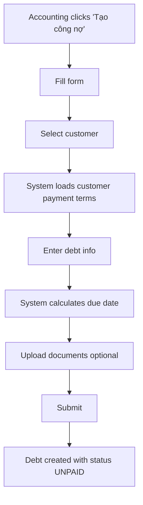
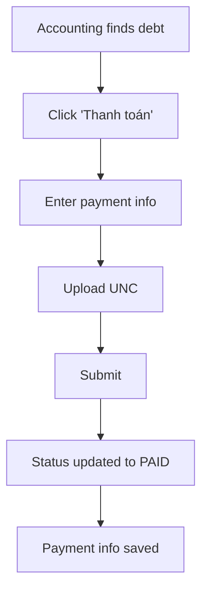
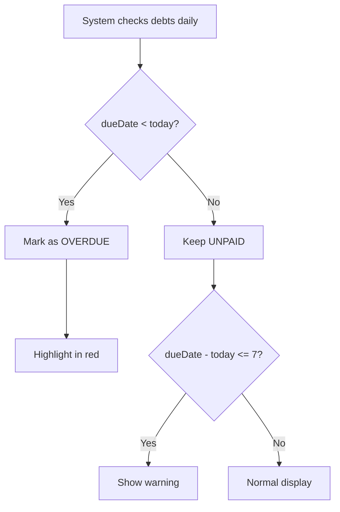

# 💰 Debt Management Feature - Complete Guide

## 📖 Quick Navigation

| Document | Description | Status |
|----------|-------------|--------|
| **[DEBT_MANAGEMENT_SUMMARY.md](./DEBT_MANAGEMENT_SUMMARY.md)** | Executive summary & overview | ✅ Complete |
| **[DEBT_MANAGEMENT_PRD.md](./DEBT_MANAGEMENT_PRD.md)** | Product requirements & user stories | ✅ Complete |
| **[DEBT_MANAGEMENT_SCHEMA.md](./DEBT_MANAGEMENT_SCHEMA.md)** | Database schema design | ✅ Complete |
| **[DEBT_MANAGEMENT_API.md](./DEBT_MANAGEMENT_API.md)** | API contracts & endpoints | ✅ Complete |
| **[DEBT_MANAGEMENT_UI.md](./DEBT_MANAGEMENT_UI.md)** | UI/UX design & components | ✅ Complete |

---

## 🎯 Feature Overview

**Quản lý Công nợ** là tính năng cho phép Accounting và Admin quản lý công nợ khách hàng một cách hiệu quả, bao gồm:

### Core Capabilities
- ✅ Quản lý công nợ theo khách hàng, theo tháng
- ✅ 3 loại công nợ: Cước vận chuyển, Chi hộ, Khác
- ✅ Tự động tính ngày đến hạn
- ✅ Cảnh báo công nợ quá hạn
- ✅ Upload chứng từ (hóa đơn, UNC)
- ✅ Tracking thanh toán
- ✅ Filter & search linh hoạt

---

## 🗂️ Data Model

### Entities

```
Customer (updated)
├── paymentTermDays: 30
├── paymentTermType: DAYS
└── debts: Debt[]

Debt (new)
├── customer: Customer
├── debtType: FREIGHT | ADVANCE | OTHER
├── debtMonth: "2026-02"
├── amount: 50,000,000
├── documentLink: "https://..."
├── invoiceImages: ["url1", "url2"]
├── notes: "..."
├── recognitionDate: 2026-02-28
├── dueDate: 2026-03-30 (auto-calculated)
├── status: UNPAID | PAID | OVERDUE | CANCELLED
├── paidAmount: 50,000,000
├── paidDate: 2026-03-25
├── paymentProofImages: ["unc1.jpg"]
└── paymentNotes: "Đã nhận chuyển khoản..."
```

---

## 🔌 API Quick Reference

### Queries
```typescript
// Get all debts with filters
getAllDebts({ 
  customerId?, 
  debtMonth?, 
  status?, 
  isOverdue? 
})

// Get single debt
getDebt({ id })

// Get summary by customer
getDebtsSummaryByCustomer({ customerId? })

// Get summary by month
getDebtsSummaryByMonth({ year? })
```

### Actions
```typescript
// Create debt
createDebt({
  customerId,
  debtType,
  debtMonth,
  amount,
  recognitionDate?,
  documentLink?,
  invoiceImages?,
  notes?
})

// Update debt
updateDebt({ id, ...updates })

// Mark as paid
markDebtAsPaid({
  id,
  paidAmount,
  paidDate,
  paymentProofImages?,
  paymentNotes?
})

// Cancel debt
cancelDebt({ id, reason? })

// Delete debt
deleteDebt({ id })
```

---

## 🎨 UI Components

### Pages
1. **DebtsListPage** (`/accounting/debts`)
   - Summary cards
   - Filters
   - Table grouped by month
   
2. **DebtDetailsPage** (`/accounting/debts/:id`)
   - Debt info
   - Payment info
   - Documents & images

### Components
- `DebtTypeBadge` - Badge cho loại công nợ
- `DebtStatusBadge` - Badge cho trạng thái
- `DebtFormModal` - Form tạo/sửa công nợ
- `MarkAsPaidModal` - Form cập nhật thanh toán
- `ImageGallery` - Gallery hiển thị hình ảnh

---

## 👥 User Roles & Permissions

| Role | View | Create | Update | Delete | Mark Paid |
|------|------|--------|--------|--------|-----------|
| **ADMIN** | ✅ | ✅ | ✅ | ✅ | ✅ |
| **ACCOUNTING** | ✅ | ✅ | ✅ | ❌ | ✅ |
| **OPS** | ✅ | ❌ | ❌ | ❌ | ❌ |
| **DISPATCHER** | ❌ | ❌ | ❌ | ❌ | ❌ |
| **DRIVER** | ❌ | ❌ | ❌ | ❌ | ❌ |

---

## 🔄 Workflows

### Create Debt Workflow


### Payment Workflow


### Overdue Detection


---

## 📊 Sample Data

### Customer with Payment Terms
```json
{
  "id": "cust-001",
  "name": "ABC Logistics Co.",
  "email": "contact@abclogistics.vn",
  "paymentTermDays": 30,
  "paymentTermType": "DAYS"
}
```

### Debt Record (Unpaid)
```json
{
  "id": "debt-001",
  "customerId": "cust-001",
  "debtType": "FREIGHT",
  "debtMonth": "2026-02",
  "amount": 50000000,
  "documentLink": "https://docs.google.com/spreadsheets/d/abc123",
  "invoiceImages": [
    "https://cloudinary.com/invoice-001.jpg"
  ],
  "notes": "Công nợ tháng 2/2026 - 10 chuyến hàng",
  "recognitionDate": "2026-02-28T00:00:00Z",
  "dueDate": "2026-03-30T00:00:00Z",
  "status": "UNPAID",
  "createdById": "user-accounting-001"
}
```

### Debt Record (Paid)
```json
{
  "id": "debt-001",
  "status": "PAID",
  "paidAmount": 50000000,
  "paidDate": "2026-03-25T00:00:00Z",
  "paymentProofImages": [
    "https://cloudinary.com/unc-001.jpg"
  ],
  "paymentNotes": "Đã nhận chuyển khoản ngày 25/3"
}
```

---

## 🧪 Testing Scenarios

### Test Case 1: Create Debt
```
Given: Accounting user logged in
When: Create debt for customer ABC, Feb 2026, 50M VND
Then: 
  - Debt created with status UNPAID
  - Due date = recognition date + 30 days
  - Appears in debts list
```

### Test Case 2: Mark as Paid
```
Given: Unpaid debt exists
When: Mark as paid with amount 50M, date 25/3, UNC image
Then:
  - Status updated to PAID
  - Payment info saved
  - Cannot edit anymore
```

### Test Case 3: Overdue Detection
```
Given: Debt with due date = 2026-03-01
When: Today = 2026-03-05
Then:
  - Status = OVERDUE
  - Highlighted in red
  - Shows "Quá hạn 4 ngày"
```

### Test Case 4: Permissions
```
Given: OPS user logged in
When: Try to create debt
Then: Button not visible / Action forbidden
```

---

## 🚀 Deployment Checklist

- [ ] Database migration applied
- [ ] Backend APIs tested
- [ ] Frontend deployed
- [ ] File upload working (Cloudinary)
- [ ] Permissions verified
- [ ] Sample data seeded
- [ ] User training completed
- [ ] Documentation updated

---

## 📞 Support

For questions or issues:
- **Technical**: Check API docs and schema
- **Business**: Review PRD and user stories
- **UI/UX**: Check UI design document

---

**Last Updated**: 2026-02-03  
**Version**: MVP 1.0  
**Status**: ✅ Design Complete - Ready for Implementation
