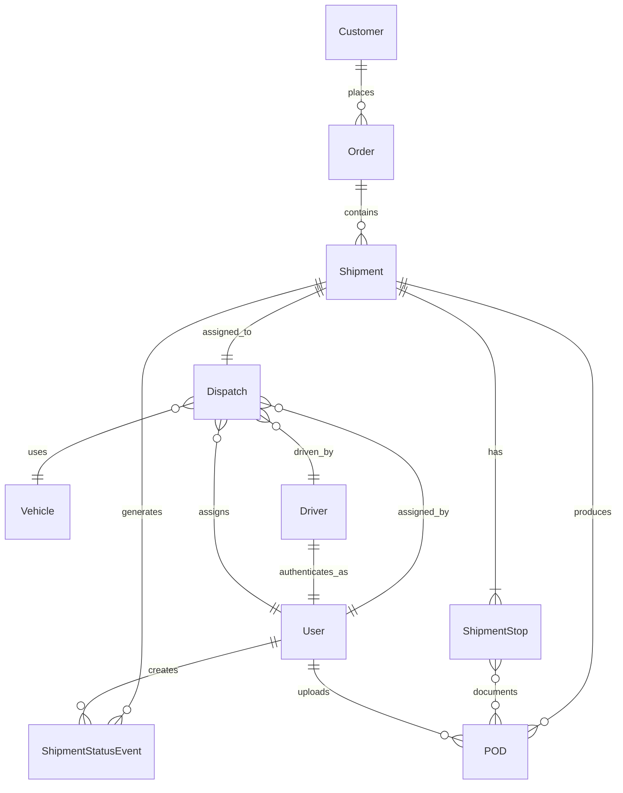

# 1. Nguyên tắc ERD v0.2

- Tách Order (yêu cầu khách) và Shipment (đơn vận hành)
- Shipment có nhiều điểm dừng (multi-leg) với thứ tự cố định
- Trạng thái được lưu dưới dạng event để audit trail
- Không xóa cứng dữ liệu nghiệp vụ (soft delete)
- POD immutable sau khi submit

# 2. Core Entities & Fields (M1)

## Customer
- `id` (UUID, PK)
- `name` (String, required)
- `email` (String, unique)
- `phone` (String)
- `address` (String)
- `created_at` (Timestamp)
- `updated_at` (Timestamp)

## Order
- `id` (UUID, PK)
- `customer_id` (UUID, FK → Customer)
- `order_number` (String, unique, auto-generated)
- `description` (String)
- `total_weight` (Decimal)
- `total_volume` (Decimal)
- `special_instructions` (Text)
- `status` (Enum: DRAFT, CONFIRMED, CANCELLED)
- `created_at` (Timestamp)
- `updated_at` (Timestamp)

## Shipment
- `id` (UUID, PK)
- `order_id` (UUID, FK → Order)
- `shipment_number` (String, unique, auto-generated)
- `current_status` (Enum: DRAFT, READY, ASSIGNED, IN_TRANSIT, COMPLETED, CANCELLED)
- `priority` (Enum: LOW, NORMAL, HIGH, URGENT)
- `planned_start_date` (DateTime)
- `planned_end_date` (DateTime)
- `actual_start_date` (DateTime, nullable)
- `actual_end_date` (DateTime, nullable)
- `created_at` (Timestamp)
- `updated_at` (Timestamp)

## ShipmentStop
- `id` (UUID, PK)
- `shipment_id` (UUID, FK → Shipment)
- `sequence` (Integer, required - xác định thứ tự stop)
- `stop_type` (Enum: PICKUP, DROPOFF, DEPOT, PORT)
- `location_name` (String, required)
- `address` (String, required)
- `contact_person` (String)
- `contact_phone` (String)
- `planned_arrival` (DateTime)
- `planned_departure` (DateTime)
- `actual_arrival` (DateTime, nullable)
- `actual_departure` (DateTime, nullable)
- `special_instructions` (Text)
- `created_at` (Timestamp)

## Vehicle
- `id` (UUID, PK)
- `license_plate` (String, unique, required)
- `vehicle_type` (Enum: TRUCK_1T, TRUCK_3T, TRUCK_5T, TRUCK_10T, CONTAINER_TRUCK)
- `capacity_weight` (Decimal, kg)
- `capacity_volume` (Decimal, m³)
- `status` (Enum: AVAILABLE, IN_USE, MAINTENANCE, OUT_OF_SERVICE)
- `current_location` (String)
- `created_at` (Timestamp)
- `updated_at` (Timestamp)

## Driver
- `id` (UUID, PK)
- `user_id` (UUID, FK → User - for auth)
- `driver_code` (String, unique)
- `full_name` (String, required)
- `phone` (String, required)
- `license_number` (String, unique)
- `license_expiry` (Date)
- `status` (Enum: ACTIVE, INACTIVE, SUSPENDED)
- `created_at` (Timestamp)
- `updated_at` (Timestamp)

## Dispatch
- `id` (UUID, PK)
- `shipment_id` (UUID, FK → Shipment, unique)
- `vehicle_id` (UUID, FK → Vehicle)
- `driver_id` (UUID, FK → Driver)
- `assigned_at` (Timestamp)
- `assigned_by` (UUID, FK → User)
- `notes` (Text)
- `created_at` (Timestamp)

## ShipmentStatusEvent
- `id` (UUID, PK)
- `shipment_id` (UUID, FK → Shipment)
- `status` (Enum - same as Shipment.status)
- `event_type` (Enum: STATUS_CHANGE, EXCEPTION, NOTE)
- `description` (String, required)
- `location` (String)
- `created_by` (UUID, FK → User)
- `created_at` (Timestamp)

## POD (Proof of Delivery)
- `id` (UUID, PK)
- `shipment_id` (UUID, FK → Shipment)
- `stop_id` (UUID, FK → ShipmentStop, nullable)
- `file_name` (String, required)
- `file_path` (String, required)
- `file_type` (Enum: IMAGE_JPG, IMAGE_PNG, DOCUMENT_PDF)
- `file_size` (Integer, bytes - max 5MB)
- `uploaded_by` (UUID, FK → User)
- `uploaded_at` (Timestamp)
- `is_submitted` (Boolean, default: false - immutable after true)

## User (Auth)
- `id` (UUID, PK)
- `email` (String, unique, required)
- `password_hash` (String, required)
- `full_name` (String, required)
- `role` (Enum: OPS, DISPATCHER, ACCOUNTING, DRIVER, ADMIN)
- `is_active` (Boolean, default: true)
- `last_login` (Timestamp, nullable)
- `created_at` (Timestamp)
- `updated_at` (Timestamp)

# 3. Entity Relationships

# 4. Key Constraints & Assumptions

## Cardinality Rules
- 1 Order → N Shipment (1 order có thể tách thành nhiều shipment)
- 1 Shipment → 1 Dispatch (1 shipment chỉ assign 1 xe tại 1 thời điểm)
- 1 Shipment → N ShipmentStop (multi-stop với thứ tự sequence bắt buộc)
- 1 Shipment → N StatusEvent (audit trail)
- 1 Shipment → N POD (multiple files per shipment)

## Business Rules Assumed
- **Vehicle Assignment**: 1 vehicle chỉ được assign cho 1 shipment tại 1 thời điểm
- **Driver Assignment**: 1 driver có thể assign multiple vehicles nhưng không concurrent shipments
- **Stop Sequencing**: Stops phải thực hiện theo thứ tự sequence (1→2→3→...)
- **Status Transition**: DRAFT → READY → ASSIGNED → IN_TRANSIT → COMPLETED
- **POD Immutability**: Sau khi submit, POD không thể thay đổi hoặc xóa

## Data Integrity
- Soft delete: thêm `deleted_at` field cho entities nghiệp vụ
- Audit trail: mọi thay đổi quan trọng ghi StatusEvent
- Referential integrity: FK constraints với CASCADE/RESTRICT phù hợp

# 5. Indexes & Performance (Planned)
- Shipment: index on (current_status, planned_start_date)
- ShipmentStop: index on (shipment_id, sequence)
- Dispatch: unique index on (shipment_id) - chỉ 1 dispatch per shipment
- POD: index on (shipment_id, is_submitted)

# 6. Rủi ro & Migration Notes

## Rủi ro Kỹ thuật
- **Status Event Volume**: N shipment × M events → cần archive strategy
- **File Storage**: POD files (images/PDF) → cần CDN/external storage
- **Concurrent Updates**: Multi-user editing → optimistic locking needed

## Migration từ v0.1 → v0.2
- Thêm fields mới cho entities hiện tại
- Populate User table từ auth system
- Migrate existing dispatches sang Dispatch table
- Set up initial status events cho shipments hiện tại

## Open Questions
- User auth: integrate với existing auth system hay standalone?
- File storage: local filesystem vs S3/Cloud Storage?
- Status workflow: cần state machine validation?
